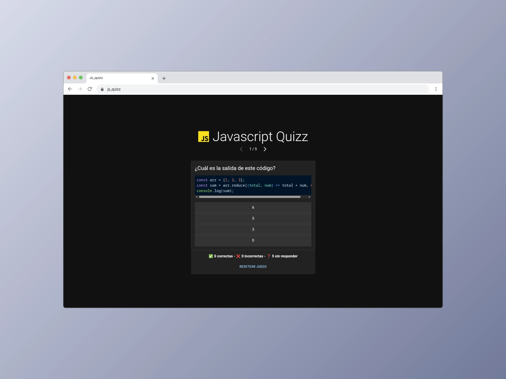

# JavaScript Quiz Web Application



This project is a web-based quiz application built with React and TypeScript, designed to demonstrate and explore two main aspects of modern web development:

1. **Material UI Integration**: The project serves as a practical implementation of Material UI components and styling, showcasing how to create a modern, responsive user interface using the Material Design system.

2. **State Management with Zustand**: Demonstrates effective state management across different components using Zustand, a lightweight and flexible state management solution.

## Technologies Used

- React 18
- TypeScript
- Material UI (MUI)
- Zustand for state management
- Vite as the build tool
- Canvas Confetti for celebration effects
- React Syntax Highlighter for code display

## Getting Started

To run this project locally:

```bash
# Install dependencies
pnpm install

# Start development server
pnpm dev

# Build for production
pnpm build

# Preview production build
pnpm preview
```

## Project Structure

The application is organized to demonstrate:

- Component composition with Material UI
- State management patterns with Zustand
- Type safety with TypeScript
- Modern React practices and hooks

## Features

- Interactive quiz interface
- Real-time state updates
- Responsive design
- Code syntax highlighting
- Celebration effects on quiz completion

## Development

This project uses Vite for fast development and building. The development server includes:

- Hot Module Replacement (HMR)
- TypeScript compilation
- ESLint for code quality
- React Fast Refresh

## License

This project is private and for educational purposes.
